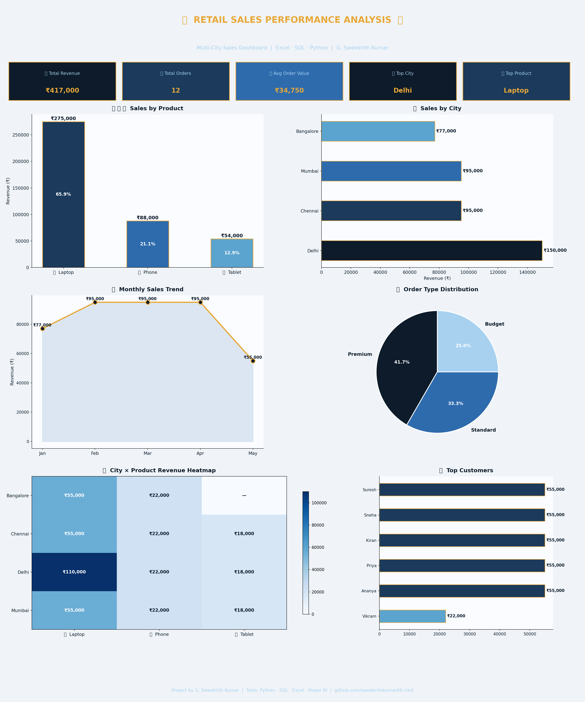

# 📊 Retail Sales Performance Analysis

## 🎯 Project Overview
End-to-end sales analysis dashboard built using Python, SQL and Excel to uncover revenue trends across cities, products and months.

## 📈 Key Findings
- 💻 **Laptops** drive **65.9%** of total revenue
- 🏙️ **Delhi** is the top performing city
- 📅 **April** recorded highest monthly sales
- 🎯 Premium customers generate 3x more revenue than budget customers

## 🛠️ Tools Used
| Tool | Purpose |
|------|---------|
| Python (Pandas) | Data cleaning and analysis |
| Matplotlib | Dashboard visualization |
| SQL | Data querying and aggregation |
| Excel | Data validation and pivot tables |

## 📊 Dashboard Preview

## 🔍 Analysis Performed
- Revenue breakdown by Product, City and Month
- Customer segmentation — Premium, Standard, Budget
- City × Product heatmap
- Monthly sales trend analysis
- Top customer identification

## 👤 Author
**G. Sweekrith Kumar** — Aspiring Business Analyst
- 📧 sweekrithkumar08@gmail.com
- 🔗 [LinkedIn](https://linkedin.com/in/sweekrith-kumar-41915b405)
